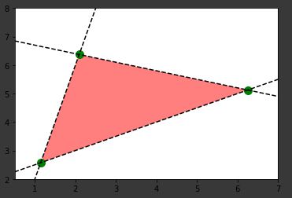

# 📈 Python ile Grafik Çizimleri

## Lineer Eşitsizlik Çizimi

```py
import numpy as np
import matplotlib.pyplot as plt
from sympy.solvers import solve
from sympy import Symbol

def f1(x):
    return 4.0*x-2.0
def f2(x):
    return 0.5*x+2.0
def f3(x):
    return -0.3*x+7.0

x = Symbol('x')
x1, =  solve(f1(x)-f2(x))
x2, =  solve(f1(x)-f3(x))
x3, =  solve(f2(x)-f3(x))

y1 = f1(x1)
y2 = f1(x2)
y3 = f2(x3)

plt.plot(x1,f1(x1),'go',markersize=10)
plt.plot(x2,f1(x2),'go',markersize=10)
plt.plot(x3,f2(x3),'go',markersize=10)

plt.fill([x1,x2,x3,x1],[y1,y2,y3,y1],'red',alpha=0.5)

xr = np.linspace(0.5,7.5,100)
y1r = f1(xr)
y2r = f2(xr)
y3r = f3(xr)

plt.plot(xr,y1r,'k--')
plt.plot(xr,y2r,'k--')
plt.plot(xr,y3r,'k--')

plt.xlim(0.5,7)
plt.ylim(2,8)

plt.show()
```


