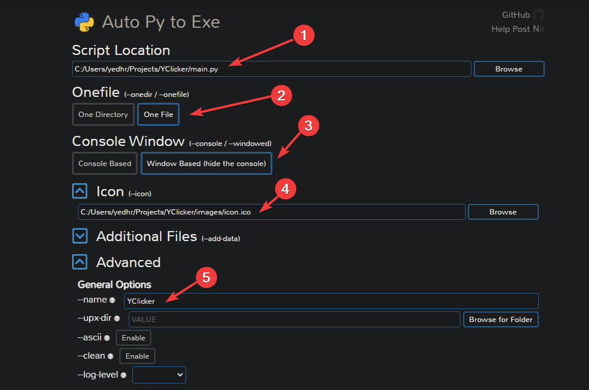

# 🖤 Executable Dosya Oluşturma

## 👀 Hızlı Notlar

* 👨‍💻 Exe dosyaları windows üzerinde direkt olarak çalışabilen dosyalardır
* 💁‍♂️ Python dosyaları da exe formatına dönüştürüldüğünde, çalıştırılması için python gerektirmez
* 🌟 Örnek proje üzerinde denemek için [⌨️ YClicker](https://github.com/YEmreAk/YClicker) projemi indirebilirsin


🐌 Python yavaş bir dil dolduğu için exe dosyaları ilk çalıştırılmada oldukça yavaş açılmaktadır


## 👷‍♂️ Exe Haline Çevirme

* 🧰 `pip install -r requirements.txt` ile gereksinimleri indirin
* ⏬ `pip install auto-py-exe` komutu ile paketi indirin
* ⭐ One file ile tek dosya içerisinde sıkıştırılmış bir exe oluşturulur
* 🖤 Window based ile konsolu açmadan pencere yapısında çalıştırır
* 🖼️ Icon yolu olarak exe dosyasında olmasını istediğiniz `ico` uzantılı dosya yolunu verin
* 📂 Additional Files kısmından kodumuzda kullanılan ek dizinleri ekleyin
  * 📢 `PyInstaller`'ın ek dizinlerdeki yolları kodda bulabilmesi için [📂 `PyInstaller` Dizinini Kullanma](executable-dosya-olusturma.md#pyinstaller-dizinini-kullanma) alanına bakın
* ⚙️ Advanced alanında uygulamanızın ismini belirleyebilirsiniz




👨‍🔧 Sorun oluşması durumunda **python 3.7 veya alt sürümlerini** indirip, deneyiniz


## 📂 `PyInstaller` Dizinini Kullanma

* 🗃️ Additional Files kısmından kodumuzda kullanılan ek dizinlerin kullanılması için ek işlem gerekir
* 💠 `resource_path` fonksiyonu ile relative olan dizinlerinizi kapsülleyin
* 💫 Yani `'images/icon.png'` kullanımı yerine `resource_path('images/icon.png')` kullanımına çevirin

```python
def resource_path(relative_path):
    """ Get absolute path to resource, works for dev and for PyInstaller """
    try:
        # PyInstaller creates a temp folder and stores path in _MEIPASS
        base_path = sys._MEIPASS
    except Exception:
        base_path = os.path.abspath(".")

    return os.path.join(base_path, relative_path)

# Örnek kullanım
self.window.iconphoto(True, PhotoImage(file = resource_path('images/icon.png')))
```


‍🧙‍♂ Detaylı bilgi için [👪 Bundling data files with PyInstaller \(--onefile\)](https://stackoverflow.com/a/13790741/9770490) alanına bakabilirsin.


## 🐞 Failed to execute main script `pyinstaller`

* 🧐 Bu hata exe dosyasını tüm paketleri indirmediğiniz durumda
* 🐞 Veya direkt olarak kodunuzun derlenmesinde hata olması durumunda gelir
* 💁‍♂️ Exe çevirisinden önce tüm gereksinimleri, sanal ortam üzerinden çevirme işlemi yapıyorsanız bile oraya da yükleyin
* ✔️ Paketleri kurduktan sonra tekrar exe çevirmesini yapın, sorun ortadan kalkacaktır
* 📂 Eğer çeviri sırasında harici dosyalarınız da varsa [📂 `PyInstaller` Dizinini Kullanma](executable-dosya-olusturma.md#pyinstaller-dizinini-kullanma) alanındaki kodu kullanmanız gerekmektedir

## 🔗 Faydalı Bağlantılar

* [👪 Bundling data files with PyInstaller \(--onefile\)](https://stackoverflow.com/a/13790741/9770490)
* [👨‍💻 YClicker](https://github.com/YEmreAk/YClicker)
* [📦 auto-py-to-exe](https://pypi.org/project/auto-py-to-exe/)
* [👨‍💻 auto-py-to-exe](https://github.com/brentvollebregt/auto-py-to-exe)


