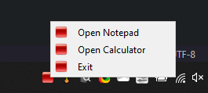

# 🍢 System Tray App

## 💡 Önemli Hususlar

* 👮‍♂️ Uygulamanın çalışması için, kod ile aynı dizinde olan `icon.png` gerekir



## ⭐ Örnek

```python
# https://github.com/vfxpipeline/SystemTray/blob/master/tray.py

import os
import sys
from PySide2 import QtWidgets, QtGui


class SystemTrayIcon(QtWidgets.QSystemTrayIcon):
    """
    CREATE A SYSTEM TRAY ICON CLASS AND ADD MENU
    """
    def __init__(self, icon, parent=None):
        QtWidgets.QSystemTrayIcon.__init__(self, icon, parent)
        self.setToolTip(f'VFX Pipeline Application Build - 3.2.56')
        menu = QtWidgets.QMenu(parent)
        open_app = menu.addAction("Open Notepad")
        open_app.triggered.connect(self.open_notepad)
        open_app.setIcon(QtGui.QIcon("icon.png"))

        open_cal = menu.addAction("Open Calculator")
        open_cal.triggered.connect(self.open_calc)
        open_cal.setIcon(QtGui.QIcon("icon.png"))

        exit_ = menu.addAction("Exit")
        exit_.triggered.connect(lambda: sys.exit())
        exit_.setIcon(QtGui.QIcon("icon.png"))

        menu.addSeparator()
        self.setContextMenu(menu)
        self.activated.connect(self.onTrayIconActivated)

    def onTrayIconActivated(self, reason):
        """
        This function will trigger function on click or double click
        :param reason:
        :return:
        """
        if reason == self.DoubleClick:
            self.open_notepad()
        # if reason == self.Trigger:
        #     self.open_notepad()

    def open_notepad(self):
        """
        this function will open application
        :return:
        """
        os.system('notepad')

    def open_calc(self):
        """
        this function will open application
        :return:
        """
        os.system('calc')


def main():
    app = QtWidgets.QApplication(sys.argv)
    w = QtWidgets.QWidget()
    tray_icon = SystemTrayIcon(QtGui.QIcon("icon.png"), w)
    tray_icon.show()
    tray_icon.showMessage('VFX Pipeline', 'Hello "Name of logged in ID')
    sys.exit(app.exec_())


if __name__ == '__main__':
    main()
```
