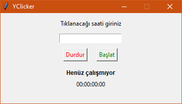

# 👨‍🎨 Tkinter

## 👀 Hızlı Bakış

* 📦 Tkinter python ile gömülü olarak gelen GUI yapım paketidir
* 🕊️ Hafif bir araçtır
* 🌟 [YClicker](https://github.com/YEmreAk/YClicker) üzerinden örnek projeye bakabilirsin

## 🧱 Temel GUI Yapımı



```python
def on_stop_clicked(): pass
def on_start_clicked(): pass

window = Tk()

window.title("YClicker")
window.resizable(False, False) # Yeniden boyutlandırmayı engeller

# Pencereyi Merkeze Alma fonksiyonuna bakınız
# centerilaze(window, 360, 180) # Mekeze verilen boyutla konumalar

frame_main = Frame(window)
frame_main.pack()

label_title = Label(frame_main, text="Tıklanacağı saati giriniz")
label_title.grid(column=0, row=row, columnspan=2, pady=(10, 0))
row += 1

# self.a_button.grid(row=0, column=1, padx=10, pady=10)
entry_time = Entry(frame_main, width=20, justify="center")
entry_time.grid(column=0, row=row, columnspan=2, pady=(10,0))
row += 1

btn_stop = Button(frame_main, text="Durdur", fg="red", command=on_stop_clicked)
btn_start = Button(frame_main, text="Başlat", fg="green", command=on_start_clicked)

btn_stop.grid(column=0, row=row, pady=10)
btn_start.grid(column=1, row=row, pady=10)
row += 1

label_counter_title = Label(
	frame_main, text="Henüz çalışmıyor", font='Helvatica 9 bold', pady=3
)

label_counter_title.grid(column=0, row=row, columnspan=2)
row += 1

label_counter = Label(frame_main, text=START_COUNTER)
label_counter.grid(column=0, row=row, columnspan=2)
row += 1

window.mainloop()
```

## 🔳 Pencereyi Merkeze Alma

```python
def centerilaze(root: Tk, width: int, height: int):
    # Gets both half the screen width/height and window width/height
    positionRight = int(root.winfo_screenwidth()/2 - width/2)
    positionDown = int(root.winfo_screenheight()/2.5 - height/2)
    
    # Positions the window in the center of the page.
    root.geometry(f"{width}x{height}+{positionRight}+{positionDown}")
    root.geometry("+{}+{}".format(positionRight, positionDown))
```


📢 2 yerine 2.5'a bölerek daha hoş bir gösterim amaçlanmaktadır.


## 🎨 GUI Yenileme

```python
running = True
while running:
    root.update()
    if data_available:
        copydata_to_gui()
root.quit()
```


‍🧙‍♂ Detaylı bilgi için [How to make Tkinter GUI thread safe?](https://stackoverflow.com/a/54304497/9770490) alanına bakabilirsin.


## 🔗 Faydalı Kaynaklar

* [👨‍🏫 Tkinter Tutorial](https://likegeeks.com/python-gui-examples-tkinter-tutorial/)
* [Frame](https://www.tutorialspoint.com/python/tk_frame.htm)

