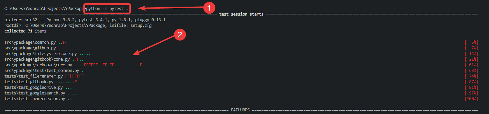
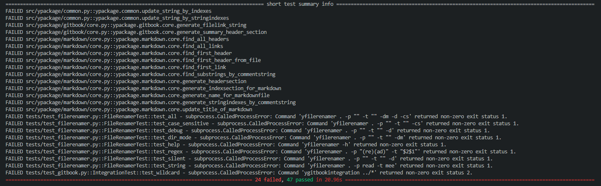

# ⚗️ Test İşlemleri

## 👀 Hızlı Bakış

* 👨‍🔬 İlerleyen zamanlarda eski metotların değişmesi durumunda, kodun istendiği gibi çalıştığından emin olunması amaçlanır
* 📈 Test metotları ile tüm kodun çalışabilirliğinin testi; **155** test için **19s** gibi **kısa** sürelerde tamamlanabilir
* 🙄 `print` metotları yerine, doğru yazılmış test yapısı zaman kazandıracaktır
* 💁‍♂️ Bu testleri elle yapmanız kesinlikle 19s'den fazla olacaktır ve de testlerin başkalarına aktarılması gerekecektir
* 🧐 Ek olarak testleri unutacağınızı da unutmayın

## 🌟 Görsel Örnekler

> 💡 Neye erişeceğinizi yapmadan önce görmeniz gerekir ki, bakmak için motivasyonunuz olsun.

* 👇 Test komutunu çalıştırdıktan sonra, çıktı aşağıdaki gibi olacaktır



* 📋 Başarısız olan testler hakkında size özet bir çıktı sunacaktır



* 🧐 Hataların tam olarak nereden geldiğini gösteren detaylı sonuçları ile hızlıca düzeltmeler yapabileceksiniz


* 🦸‍♂️ Eğer VS Code kullanıyorsanız, kırmızı linklere tıklayıp, direkt olarak hatalı satıra gidebilirsiniz
* 💁‍♂️ Ayrıca ✲ Ctrl P komutuna basıp çıkan ekrana, : karakterini koyup, satır ve sütun değerlerini yazıp ilgili alana geçebilirsiniz
* 🚀`input.py:6:1` değeri ile input dosyasının **6. satır 1. sütun** alanına gidersiniz


👨‍🔬 Bu çıktıların hepsi [📦 YPackage](https://github.com/yedhrab/YPackage) üzerindeki test sonuçlarıdır. Test içerek bir proje örneği için projeme kesinlikle bakmanı ve notlarımın örneklerini projem üzerinden bulmanı öneririm.


## 📑 Doküman Testi

* 👨‍🔬 Metotlar, kendi dokümanları ile test edilir
* 👨‍💻 `>>>` başlangıç eki ile kodlar yazılır
* 🚩 `...` başlangıç eki ile de girinti gereken satırlar oluşturulur
* 👁️ Kod çıktılarını hemen alt satıra yazılır, test işleme **çıktılara eşit mi** kontrolü yapar
* 👮‍♂️ String çıktıları için `'` karakteri arasına yazmanız gerekir
* 🕊️ Her işlemin çıktısı olması gerekmez
* 🚀 Harici fonksiyonlar da kullansa, doküman ile test edilebilir

> 💁‍♂️ Ufak metotlar için doküman ile testi çok daha efektif bulmaktayım


📢 Whitespace karakterleri, örneğin `\n`  için `'` karakteri arasında `\\n` olarak belirtilir


```python
def generate_stringindexes_by_commentstring(
    index_string: str
) -> Tuple[str]:
    """Verilen indeks için başlangıç ve bitiş index metni oluşturur

    Arguments:
        index_string {str} -- İndeks metni

    Returns:
        Tuple -- (başlangıç, bitiş) indeks metinleri

    Examples:
        >>> generate_stringindexes_by_commentstring('Index')
        ('<!--Index-->\\n\\n', '\\n\\n<!--Index-->')
    """
    start_string = Comment(index_string) + "\n\n"
    end_string = "\n\n" + Comment(index_string)
    return start_string, end_string


def generate_indexsection_for_markdown(string: str) -> str:
    """Markdown metni için indeks alanı oluşturur

    Arguments:
        string {str} -- indeks metni

    Returns:
        str -- Oluşturulan indeks alanı

    Examples:
        >>> generate_indexsection_for_markdown('Index')
        '<!--Index-->\\n\\n\\n\\n<!--Index-->'
    """
    s1, s2 = generate_stringindexes_by_commentstring(string)
    return s1 + s2
```


‍🧙‍♂ Detaylı bilgi için [Doctest integration for modules and test files](https://docs.python.org/3/library/doctest.html) alanına bakabilirsin.


## 🍎 Test Sınıfları

* 💡 Test ismi ile başlayan her obje test için kullanılır
* 👷‍♂️ Test sınıfındaki  her oluşturulduğunda `setup_class` ve `teardown_class` metotları tetiklenir
* ⚙️ `setup_class` metodu class oluşturulduğunda çalıştırılır, testin `__init__` işlemi gibi düşünülebilir, alttaki işlemler için kullanılabilir:
  * ✨ Yerel değişkenler oluşturmak
  * 📂 Test için dosya dizin oluşturmak
* 💥 `teardown_class` metodu class sonlandırıldığında çalıştırılır, alttaki işlemler için kullanılabilir:
  * 💦 Test için oluşturulan dosya ve dizinleri temizlemek
* 💁‍♂️ `setup_method` ve `teardown_method` işlemleri sınıflar değil;  metotlar oluşturulup, kaldırıldığında tetiklenir

```python
class TestClassFirst:

    def setup_class(cls):
        pass

    def test_buttons(self, data):
        # self.$attribute can be used, but not cls.$attribute?  
        pass

    def test_buttons2(self, data):
        # self.$attribute can be used, but not cls.$attribute?
        pass

    def teardown_class(cls):
        pass
        
class TestClassSecond:

    def setup_method(self, test_method):
        # configure self.attribute

    def teardown_method(self, test_method):
        # tear down self.attribute

    def test_buttons(self):
        # use self.attribute for test
```


‍🧙‍♂ Detaylı bilgi için [How do I correctly setup and teardown my pytest class with tests?](https://stackoverflow.com/questions/26405380/how-do-i-correctly-setup-and-teardown-my-pytest-class-with-tests) alanına bakabilirsin.


## 👮‍♂️ Çıktıların Kontrol Edilmesi

* 👷‍♂️ Test işlemleri için `pytest` modülü kullanılması tavsiye edilir
* 💁‍♂️ `pytest` ile `assert` anahtar kelimesi ile testin sonucunun, beklenen sonuca eşit olmasını kontrol edin
* 👨‍💻 `assert test_result() == 2`
* ✨ `pytest` modülü çıktılarınızı anlaşılır bir şekilde size sunacaktır

```python
def foo():
    return 2

def test_result():
    assert foo() == 2
```

## 🐛 Hata Mesajları Bekleme

* 👮‍♂️ Beklenen hata mesajları için `with` yapısı kullanılır
* 🧐 Beklediğin hata tipini `with` içerisinde yazıp, alt scope'una kodlarınızı yazın
* 💁‍♂️ Eğer içeride hata fırlatılmazsa `pytest` test başarısız olarak gösterecektir
* 🧐 Hataları filtrelemek için `match` parametresi ile filtre değeri verebilirsiniz

```python
def test_subprocess():
    with pytest.raises(subprocess.SubprocessError):
        subprocess.check_output(
            "ygitbookintegration {}".format(args),
            universal_newlines=True
        )

def test_custom_subprocess():
    with pytest.raises(subprocess.SubprocessError, match="0"):
        subprocess.check_output(
            "ygitbookintegration {}".format(args),
            universal_newlines=True
        )
```

## ⚗️ Test İşlemini Yapma

* 🖤 Test komutu `python -m pytest` olarak bilinir
* 🕵️‍♂️ `pytest` test işlemleri için isminin başında `test` içeren metot ve sınıflar kullanır
* 🔨 `pytest` tüm test paketlerini **varsa** `setup.cfg` dosyasında belirtildiği şekilde bulacaktır
* 🧐 `flake8 --exclude=venv* --statistics` komutu ile kod kalitesini ölçebilirsiniz


📢 Sadece `pytest`komutu hatalara sebebiyet vermekte


## 📂 Dizin Yapılandırması

* 📢 Dizinler içerisinde python kodlarının olduğu belirtmek için `__init__.py` dosyalarının olması gerekir
* 👮‍♂️ Dosyalar olmadan, python kodlarına diğer python kodlarından **erişilemez**
* 📈 Verimlilik adına test  ve kaynak kodların ayrı dizinlerde saklanması tavsiye edilir

```yaml
setup.py
setup.cfg
src/
    mypkg/
        __init__.py
        app.py
        view.py
tests/
    __init__.py
    foo/
        __init__.py
        test_view.py
    bar/
        __init__.py
        test_view.py
```


‍🧙‍♂ Detaylı bilgi için [Choosing a test layout / import rules](https://docs.pytest.org/en/latest/goodpractices.html#choosing-a-test-layout-import-rules) alanına bakabilirsin.


## 🔨 Yapılandırma Dosyası

* 📃 Test yapılandırma dosyası olarak `setup.cfg` dosyası kullanılır
* 💡 `[<modül>]` şeklinde modüle özgü ayarlar tanımlanır
* 🧪 `pytest` için `[tool:pytest]` alanı altında test yapılandırması yapılır
* 👀 `pytest`'in bakacağı dizinler `python_files` ve `testpaths` alanında belirtilir
* 👨‍🔬 Test işlemleri için `python setup.py test` komutunu kullanabilirsin

> 🙄 Kullanabilirsin dedim ama, lütfen o komutu kullan

```yaml
[flake8]
max-line-length = 99
max-complexity = 11
exclude = */migrations/*

[options]
# tests_require is a list of dependencies that are *absolutely required*
# to run the tests. tests_require is used when running tests from your
# *current* Python environment (that is, not using tox).
# tests_require is ignored by tox.
#
# As such, you can usually get away with neglecting tests_require ---
# it's not a big deal if some of the dependencies get left out.
#
# If you're running tests from your current environment, it's because
# you're actively developing, in which case you usually have an
# environment you built for development. But if you have to change
# environments mid-development for any reason, tests_require can save you
# from getting tripped up.
#
# tests_require is used when running tests and debugging through an IDE like
# PyCharm, to ensure the environment the IDE is using has the requirements.
#
# Unless you're in one of those situations, you can simply ignore this.
tests_require = pytest

[aliases]
# Alias `setup.py test` to `setup.py pytest`
test = pytest

[tool:pytest]
# If a pytest section is found in one of the possible config files
# (pytest.ini, tox.ini or setup.cfg), then pytest will not look for any others,
# so if you add a pytest config section elsewhere,
# you will need to delete this section from setup.cfg.
norecursedirs =
    .git
    .tox
    .env
    venv
    dist
    build
    migrations

python_files =
    test_*.py
    *_test.py
    tests.py
    
addopts =
    -ra
    --strict
    --ignore=docs/conf.py
    --ignore=setup.py
    --ignore=ci
    --ignore=.eggs
    --doctest-modules
    --doctest-glob=\*.md
    --tb=short
    --pyargs

# Depracated çıktılarını gizleme
filterwarnings =
    ignore::DeprecationWarning    

# Yeni test çıktısı yapısını kullanma
junit_family=xunit2

# Test miktarlarını yüzdeli değil, miktarlarla gösterme
console_output_style=count

# The order of these options matters. testpaths comes after addopts so that
# nameless in testpaths is interpreted as
# --pyargs nameless.
# Any tests in the src/ directory (that is, tests installed with the package)
# can be run by any user with pytest --pyargs nameless.
# Packages that are sensitive to the host machine, most famously NumPy,
# include tests with the installed package so that any user can check
# at any time that everything is working properly.
# If you do choose to make installable tests, this will run the installed
# tests as they are actually installed (same principle as when we ensure that
# we always test the installed version of the package).
# If you have no need for this (and your src/ directory is very large),
# you can save a few milliseconds on testing by telling pytest not to search
# the src/ directory by removing
# --pyargs and nameless from the options here.
testpaths =
    src/ypackage
    tests/
```

## 🔸 Unit Test İşlemleri

* 📦 Unit test için `unittest` paketi kullanılır
* 💠 `setUp`  metodu ile her test öncesi işlemler tanımlanır
* 💦 `tearDown` metodu ile de her test sonrası işlemler tanımlanır
* 👨‍💼 `python -m pytest` komutu ile çalıştırılabilirler

> 🌇 Eskimiş bir yapıdır, tavsiye etmiyorum

```python
from unittest import TestCase

class TestStringMethods(TestCase):

    def setUp(self):
        self.p = subprocess.Popen('notepad')

    def test_upper(self):
        self.assertEqual('foo'.upper(), 'FOO')

    def test_isupper(self):
        self.assertTrue('FOO'.isupper())
        self.assertFalse('Foo'.isupper())

    def test_split(self):
        s = 'hello world'
        self.assertEqual(s.split(), ['hello', 'world'])
        # check that s.split fails when the separator is not a string
        with self.assertRaises(TypeError):
            s.split(2)
            
    def tearDown(self):
        self.p.terminate()

if __name__ == '__main__':
    unittest.main()
```


‍🧙‍♂ Detaylı bilgi için [`unittest`](https://docs.python.org/3/library/unittest.html) paketine bakabilirsin.


## 🔗 Faydalı Bağlantılar

* [📖 Choosing a test layout / import rules](https://docs.pytest.org/en/latest/goodpractices.html#choosing-a-test-layout-import-rules)
* [📖 Doctest integration for modules and test files](https://docs.python.org/3/library/doctest.html)
* 👪 [How do I correctly setup and teardown my pytest class with tests?](https://stackoverflow.com/questions/26405380/how-do-i-correctly-setup-and-teardown-my-pytest-class-with-tests)

